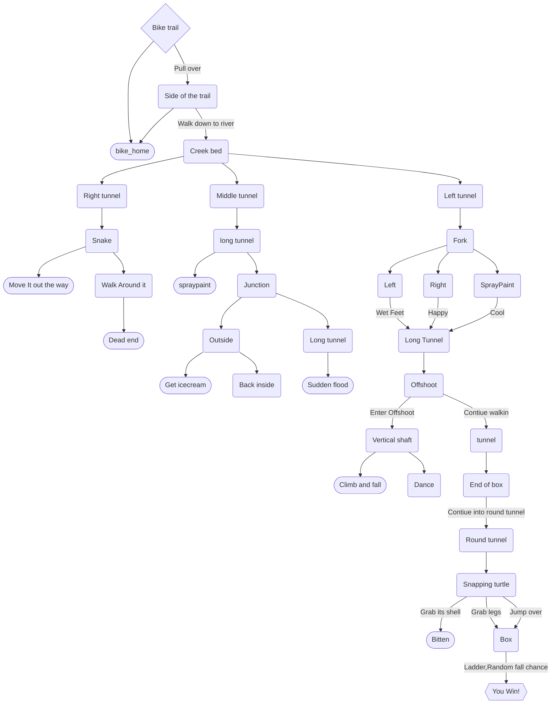

# Find the sunset!

## Setting

This game takes place at the Arlington Career Center. I tried to f
faithfully recreate it, with the exception of moving the 
library to the first floor.

## Map

The player will start on the bike trail, they must eventuly navigate the tunnels to find a great spot to watch the sun set. 

## Story

A curous player will conqure the deep dark concrete maddness under the city
They will face many threats along the way. can they make it out before the sun has gone down.

## Global Variables

To start i will have the variables, FlashlightState, Time, Emotions, and CoolFactor.
Emotions will not matter but i want to add a use for it. FlashlightState will need to be 
true so that the player can see in the dark. Time limits the player, if they reach the end
after the time is up, they wont see the sky, only the dark overcast sky. CoolFactor is by
far the most inportant variable, if you dont think so, then your a nerd.  